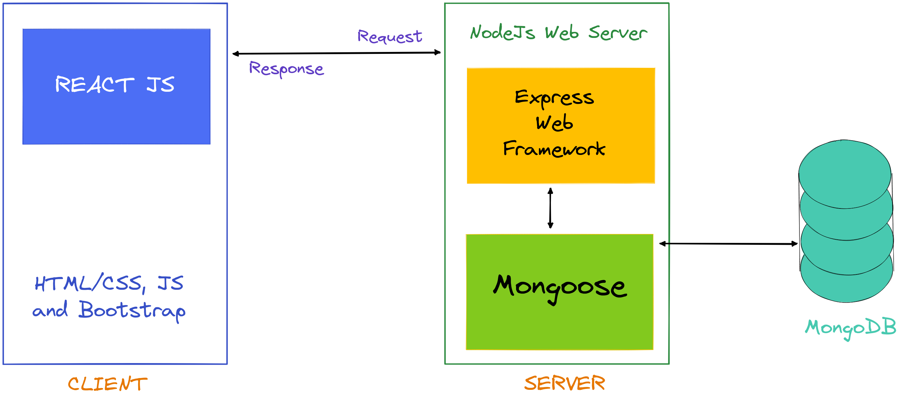
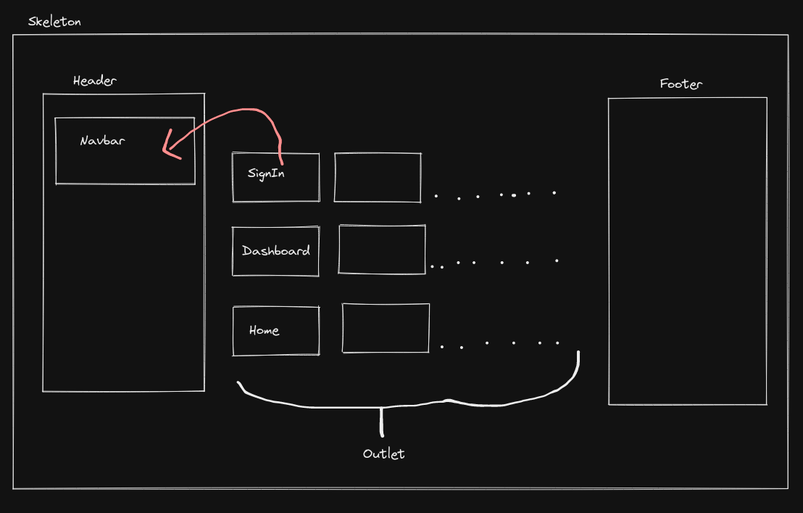
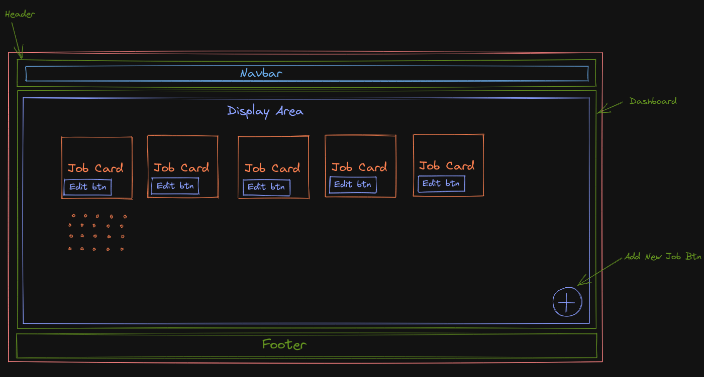
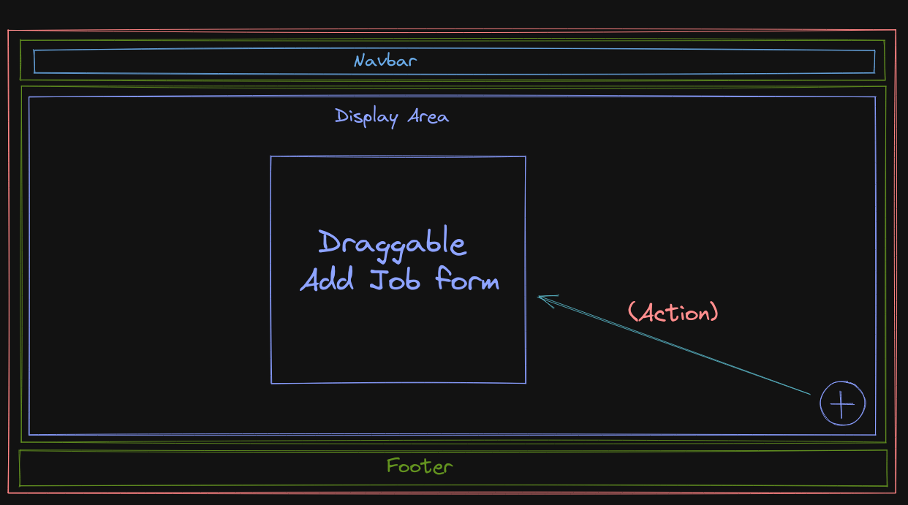

# Jobify

Dashboard to manage Jobs

## Development flow



## Testing

### Dummy credentials

&nbsp;&nbsp;&nbsp;&nbsp;&nbsp;&nbsp;`email : test@test.com`\
&nbsp;&nbsp;&nbsp;&nbsp;&nbsp;&nbsp;`password : secret`

## Project Structure

```
📦Jobs-Manager
 ┣ 📂client
 ┃ ┣ 📂public
 ┃ ┃ ┣ 📂assets
 ┃ ┃ ┃ ┣ 📜home-2-blur.jpg
 ┃ ┃ ┃ ┣ 📜home-2.jpg
 ┃ ┃ ┃ ┣ 📜logo-white.png
 ┃ ┃ ┃ ┗ 📜logo.png
 ┃ ┃ ┣ 📜_redirects
 ┃ ┃ ┗ 📜index.html
 ┃ ┣ 📂res
 ┃ ┃ ┗ 📜links.txt
 ┃ ┣ 📂src
 ┃ ┃ ┣ 📂components
 ┃ ┃ ┃ ┣ 📜AddForm.js
 ┃ ┃ ┃ ┣ 📜Copyright.js
 ┃ ┃ ┃ ┣ 📜EditForm.js
 ┃ ┃ ┃ ┣ 📜Footer.js
 ┃ ┃ ┃ ┣ 📜Header-old.js
 ┃ ┃ ┃ ┣ 📜Header.js
 ┃ ┃ ┃ ┣ 📜JobCard.js
 ┃ ┃ ┃ ┣ 📜Loader.js
 ┃ ┃ ┃ ┣ 📜Notification.js
 ┃ ┃ ┃ ┗ 📜Skeleton.js
 ┃ ┃ ┣ 📂containers
 ┃ ┃ ┃ ┣ 📜404.js
 ┃ ┃ ┃ ┣ 📜Dashboard.js
 ┃ ┃ ┃ ┣ 📜Home.js
 ┃ ┃ ┃ ┣ 📜SignIn.js
 ┃ ┃ ┃ ┗ 📜SignUp.js
 ┃ ┃ ┣ 📂helpers
 ┃ ┃ ┃ ┗ 📜jobStatus.js
 ┃ ┃ ┣ 📂utils
 ┃ ┃ ┃ ┣ 📜auth.js
 ┃ ┃ ┃ ┗ 📜browserActions.js
 ┃ ┃ ┣ 📜App.js
 ┃ ┃ ┣ 📜index.js
 ┃ ┃ ┣ 📜routes.js
 ┃ ┃ ┗ 📜style.css
 ┃ ┣ 📜.gitignore
 ┃ ┣ 📜README.md
 ┃ ┣ 📜package-lock.json
 ┃ ┗ 📜package.json
 ┣ 📂server
 ┃ ┣ 📂controllers
 ┃ ┃ ┣ 📜auth.js
 ┃ ┃ ┗ 📜jobs.js
 ┃ ┣ 📂db
 ┃ ┃ ┗ 📜connect.js
 ┃ ┣ 📂errors
 ┃ ┃ ┣ 📜bad-request.js
 ┃ ┃ ┣ 📜custom-api.js
 ┃ ┃ ┣ 📜index.js
 ┃ ┃ ┣ 📜not-found.js
 ┃ ┃ ┗ 📜unauthenticated.js
 ┃ ┣ 📂middleware
 ┃ ┃ ┣ 📜authentication.js
 ┃ ┃ ┣ 📜error-handler.js
 ┃ ┃ ┗ 📜not-found.js
 ┃ ┣ 📂models
 ┃ ┃ ┣ 📜Job.js
 ┃ ┃ ┗ 📜User.js
 ┃ ┣ 📂routes
 ┃ ┃ ┣ 📜auth.js
 ┃ ┃ ┗ 📜jobs.js
 ┃ ┣ 📜.env
 ┃ ┣ 📜.gitignore
 ┃ ┣ 📜Procfile
 ┃ ┣ 📜README.MD
 ┃ ┣ 📜app.js
 ┃ ┣ 📜package-lock.json
 ┃ ┣ 📜package.json
 ┃ ┗ 📜swagger.yaml
 ┣ 📜ClientWorkFlow.excalidraw
 ┗ 📜README.md
```

## Mockup of project




